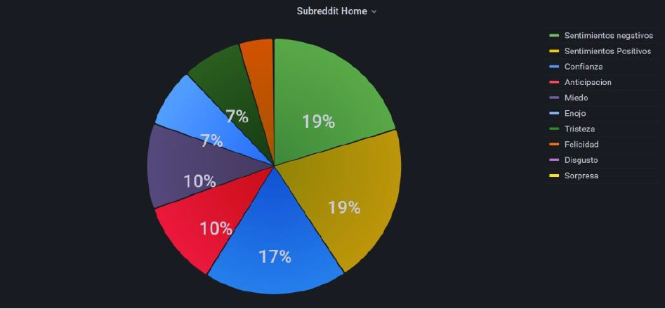
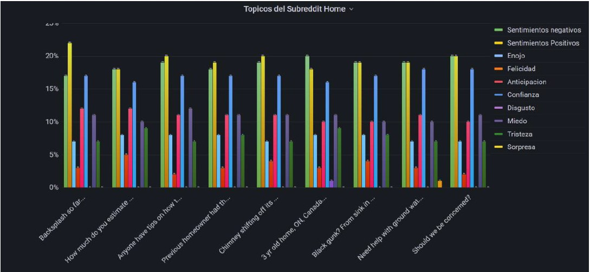

# RedditSentiment

As part of my university studies, I carried out my final project in the field of natural language processing. Using the NRC Word-Emotion Association Lexicon and the Reddit API, I obtained different comments and analyzed the emotions conveyed by each person in various subreddits and comment threads.

The idea is also to have a system for learning new words based on the context in which they are used.

In this repository, I will be sharing an improved implementation of my project, aiming to apply more efficient and effective programming techniques. Additionally, the original report of my project (in Spanish) can be found in PDF format.

Originally, I utilized Grafana to generate visualizations of the emotions present in a subreddit as well as its individual posts.

 

Recently, I collected several comments and their associated emotions, and trained a neural network to determine the emotions of comments without the need to check a database.